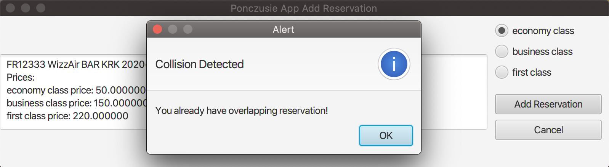
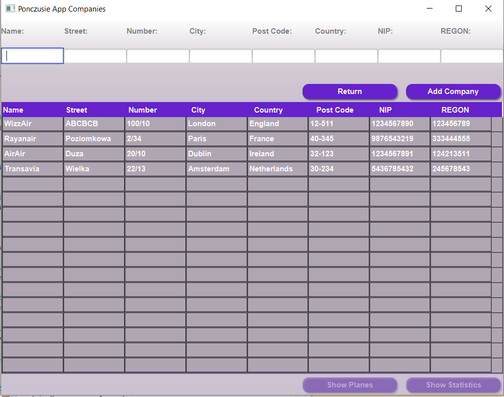

# Ponczusie - flight system
Opis sposobu reazlizacji oraz dokumentacja utworzonego systemu.

## Jak uruchomić?
1. Aplikacja wymaga połączenia z VPN-AGH. Upewnij się że zostało ono skonfigurowane
2. Przejdź do katalogu czw-1615-ponczusie
3. Uruchom w terminalu komendę:
```
 gradle run
```
4. Wprowadzone dane do widoku logowania: <br> zwykły użytkownik: login:**abc@abc.com** hasło: **abc** <br> administrator: login: **admin@admin.com** hasło: **admin** <br>
<br>Tylko email w domenie 'admin.com' daje dostęp do panelu administratora.

## Przebieg pracy
Poniżej przedstawiono za co były odpowiedzialne poszczególne osoby w grupie.

Model jako podstawa projektu został zrealizowany przy zaangażowaniu wszystkich członków grupy, aby usprawnić dalsze rozbudowywanie projektu. 
Wspólnie zapoznaliśmy się także z technologią JavaFx i tworzeniem widoków.
Dalszą część projektu również staraliśmy się realizować całą grupą korzystając ze spotkań online i udostępniania ekranu.
Mamy nadzieję, że dzięki temu, każdy będzie zaznajomiony z całą zawartością projektu.

## Wymagania zrealizowane na m1

* Zbudowano model systemu rezerwacji biletów lotniczych
* Wprowadzanie nowego użytkownika poprzez rejestrację (dla maila w domenie admin.com przydzielone są uprawnienia administratora, w pozostałych przypadkach utworzony zostaje konto klienta)
* Logowanie istniejącego użytkownika (admin lub klient w zależności od nadanych uprawnień). Po zalogowaniu przenosi odpowiednio do panelu użytkownika lub administratora
* Wprowadzanie do aplikacji nowych przewoźników w panelu administratora
* Panel do przeglądania dostępnych lotów widoczny dla kienta
* Rezerwowanie biletów na dany lot i klasę (z uwzględnieniem konfliktów) w panelu klienta

## Wymagania zrealizowane na m2

* Działająca warstwa persystencji
* Autentykacja i autoryzacja (zrealizowana w m1)
* CRUD dla lotów
* Wyszukiwanie lotów o wybranych przez klienta parametrach
* Dodanie informacji o konfliktach podczas rezerwacji biletów (zrealizowana w m1)
* Realizacja dodawania samolotów oraz lotnisk
* Zarządzanie rezerwacjami przez klienta (usuwanie, wyświetlanie)
* Dodanie głównego panelu administratora, z którego będzie się przechodzić do poszczególnych widoków np. do widoku dodawania przewoźników.

## Wymagania zrealizowane na m3
* Statystyki
* Dopracowanie tabel
* Rekomendacje dla klienta
* Design, user experience
* Powiadomienie przez e-mail o nadchodzących lotach
* Naprawa drobnych błędów

## Osoby odpowiedzialne za poszczególne części

### Izabela Czajowska
m1:
* Utworzone zostały kontrolery
FlightReservationController, AddReservationController i widoki FlightReservationPane, AddReservationPane.
* Rezerwowanie biletów na dany lot i klasę (z uwzględnieniem konfliktów) w panelu klienta. 
* Modyfikacja AccountAppController w celu komunikacji z nowo utworzonymi kontrolerami.

m2:
* Opracowanie sposobu łączenia z bazą danych przy użyciu technologii hibernate oraz bazy danych MYSQL na serwerze AGH
* Dodanie nowych dependencies, utworzenie pliku hibernate.cfg.xml - połączenie z bazą danych MySQL
* Mapowanie wszystkich klas modelu jako entites do bazy danych
* ClientAllReservationController + view
* Usuwanie rezerwacji przez klienta
* PlaneController + view

m3:
* Wysyłanie e-maili raz dziennie do klientów mających rezerwację na loty w dniu następnym 
* Design, user experience
* Dopracowanie tabel

### Agata Nowara
m1:
* Stworzenie AccountApp, która dziedziczy po javafx.application.Application.
* Utworzenie widoku CompaniesPane oraz kontrolera CompanyController, służącego do dodawania nowych przewoźników.
* Modyfikacja AccountAppController w celu komunikacji z nowo utworzonym kontrolerem.

m2:
* CRUD dla lotów, UpdateFlightController + view, modyfikacja FlightController
* Modyfikacja kontrolerów, użycie serwisów do połączenia z bazą danych
* Modyfikacja serwisów - wykorzystanie jednej sesji dla danego uruchomienia aplikacji
* Panel Admina + view
* AirportController + view

m3:
* Wykres zarobków rocznych przewoźników, statystyki
* Design, user experience
* Dopracowanie tabel 

### Patryk Siwek
m1:
* Dodawanie nowego użytkownika (klienta/administratora) przy użyciu widoku AccountSignUp 
i kontrolera AccountSignUpController. 
* Nadawanie uprawnień użytkownikom.  
* Modyfikacja AccountAppController w celu komunikacji z nowo utworzonym kontrolerem.


m2:
* Stworzenie interface DAO
* Dodanie DAO i Service dla każdej klasy modelu
* Modyfikacja kontrolerów, użycie serwisów do połączenia z bazą danych
* FlightController + view 

m3:
* Statystyki po stronie klienta i administratora
* Rekomendacje lotów dla klienta

### Tomasz Kłusak
m1:
* Logowanie(kontroler AccountLoginController,widok AccountLogIn), autoryzacja przy pomocy maila i hasła. 
* Stworzenie Data Generatora w celu testowania aplikacji. 
* Modyfikacja AccountAppController w celu komunikacji z nowo utworzonym kontrolerem.

m2:
* Filtrowanie lotów w widoku klienta

m3:
* —

## Przedstawienie zastosowanej metody
Do realizacji systemu wykorzystano wzorzec Model View Controler (MVC).

 <br>

Zastosowanie wzorca pozwoliło na:

* podział aplikacji na moduły porządkujące kod,
* uniezależnienie modelu od widoku,
* łatwiejszą rozbudowę dzięki budowie modułowej,
* oddzielenie logiki biznesowej od interfejsu użytkownika,
* zapobiegnięcie tworzenia bałaganu w kodzie,
* łatwiejszą realizację pracy zespołowej (dzięki budowie modułowej).

W celu realizacji tego wzorca wykorzystano technologię JavaFX poznaną na laboratoriach i wykorzystano wbudowane mechanizmy

## Warstwa persystencji
 <br>
W projekcie wykorzystany został framework Hibernate do realizacji warstwy dostępu do danych.  
Do hostowania użyliśmy serweru baz danych AGH, który udostępnia użytkownikom bazy MySQL. Z bazą danych można się połączyć przy pomocy protokołu TCP: serwer mysql.agh.edu.pl, port 3306. Połączenia te możliwe są wyłącznie z sieci AGH. Wszystkie **credentials** dostępowe umieszczone zostały w pliku **hibernate.cfg.xml** 

## Zapoznanie się z układem projektu i jego elementami
1. Model danych - pakiet model 
2. Kontrolery dla wszystkich widoków - pakiet controller <br> Inicjalizacja odbywa się przy pomocy głównego kontrolera - **AccountAppController**
3. Widoki - zawartość katalogu resources/view
4. DAO - dostarcza jednolity interfejs dla komunikacji aplikacji ze źródłem danych
5. Serwisy - pośredniczą w dostępie do bazy danych z modelu
6. Główna Aplikacja - AccountAppJava

## Schemat UML

 <br>

## Prezentacja działania aplikacji
### Widoki aplikacji udostepnione dla klientów
### Logowanie
 <br>
Użytkownik posiadający konto powinien podać swój e-mail oraz hasło do konta i nacisnać **Log In**. 
W przypadku gdy użytkownik nie posiada jeszcze konta, nalezy nacisnąć przycisk **Sign Up**
### Rejestracja
 <br>
Nowi użytkownicy przechodzą do panelu Rejestracja, gdzie po wpisaniu poprawnych paranetrów mogą załozyć konto. Wpisany mail, nie może znajdować się już w istniejącej bazie maili, w przeciwnym razie rejestracja nie zakończy się sukcesem.
#### Walidacja wprowadzonych danych
W przypadku niepoprawnego wypełnienia pola wyświetli się alert z informacją jak prawidłowo uzupełnić dane pole. <br>

 <br>
Wprowadzony mail musi być postaci: identyfikator@pełna_nazwa_domeny np. abc@abc.com <br>

  <br>
Hasło musi składać się przynajmniej z czterech znaków. <br>

 <br>
Imię i nazwisko muszą zaczynać się wielką literą np. Jan, Kowalski. <br>

 <br>
Numer dokumnetu, którym posługuje się klient musi składać się z od 7 do 9 znaków. <br>

 <br>
Możliwe typy dokumentów weryfikujących tożsamość to dowód osobisty (ID) lub paszport (PASSPORT). Należy wpisać jeden z wybranych dokumentów zgodnie z podpowiedzią w nawiasie. <br>

#### Pomyślna rejestracja
 <br>
Powyżej zamieszczono przykładowy formularz rejestracyjny z poprawnie wypełnionymi polami. <br>

### Główny widok dla klientów
 <br>
Zaraz po zalogowaniu klient przechodzi do okna, w którym może przegladać dostępne loty. Może też wyszukiwać wśród dostępnych lotów podając takie parametry jak lotnisko początkowe, docelowe, data, czas i cena lotu. Lista lotów zostanie odfiltrowana, jak poniżej: <br>


 <br>

### Rezerwacja biletu

#### Wybór lotu
 <br>
W celu rezerwacji konkretnego lotu, należy wybrać lot (podświetli się na niebiesko), a następnie nacisnąć guzik **Add Reservation**. <br>

#### Przegląd cen i wybór klasy komfortu
 <br>
Po wybraniu lotu przechodzimy do panelu, gdzie możemy zapoznać się ze szczegółowym cennikiem na dany lot i wybrać klasę komfortu, a na końcu potwierdzić klikając **Add Reservation**. W przypadku, gdy chcemy zrezygnować z rezerwacji wybranego wcześniej lotu, klikamy na guzik **Cancel** i wracamy do poprzedniego widoku. <br>

#### Wykrywanie kolizji wśród rezerwacji klienta
 <br>
Po naciśnięciu **Add Reservation**, sytem weryfikuje, czy nie dochodzi do kolizji z już zarezerwowanymi przez klienta innymi lotami. W przypadku wystąpienia takiej kolizji pojawia się alert, oraz rezerwacja jest anulowana.Po naciśnięciu **Ok** wraca się do głównego widoku lotów.

#### Widok wszystkich rezerwacji klienta
 <br>
Klient może przeglądnąć swoje rezerwacje, a także usuwać je.


### Widoki aplikacji udostepnione dla administratorów
### Logowanie
 <br>
Użytkownik posiadający konto administratora powinien zalogować się podając mail z domeny admin.com oraz odpowiednie hasło, a na końcu kliknąć **Log In**.
W przypadku gdy konto jeszcze nie istnieje należy przejść do panelu Rejestracji wciskając **Sign Up** <br>

### Rejestracja
 <br>
Rejestracja przebiega tak samo jak w przypadku zwykłego klienta. Aby dostać rolę administratora, trzeba podać mail w domenie **admin.com**. <br>

### Logowanie nowego użytkownika
 <br>
Po zarejestrowaniu automatycznie przechodzi się do panelu logowania.<br>

### Strona startowa dla admina
 <br>
Strona do której przechodzimy po zalogowaniu się jako admin.<br>

### Dodawanie przewoźnika
 <br>
Po wybraniu "Companies" na stronie głównej admina przechodzi się do okna, w którym można przeglądać przewoźników lub dodać nowego po wprowadzeniu wszystkich danych i zatwierdzeniu poprzez wciśnięcie **Add Company**. Po naciśnięciu przycisku pola są czyszczone, aby móc wpisać dane kolejnego przewoźnika do dodania.  Istnieje możliwość przejścia do widoku wszystkich samolotów należących do danego przewoźnika przy pomocy przycisku **show planes** <br>


#### Walidacja wprowadzonych danych
W przypadku niepoprawnego wypełnienia pola wyświetli się alert z informacją jak prawidłowo uzupełnić pole. <br>

 <br>
Nazwa przewoźnika jest dowolna, poza ograniczeniem, że musi zaczynać się wielką literą. Może zawierać znaki specjalne takie jak @, &, #, !<br>

 <br>
Nazwa ulicy musi zaczynać się wielką literą i może składać się z kilku członów (każdy człon z wielkiej litery) np Boleslawa Prusa <br>

 <br>
Numer lokalu może zawierać zarówno numer budynku, jak i numer_budynku/numer_mieszkania. Żaden z tych dwóch numerów nie może zaczynać się od 0.

 <br>
Nazwa miasta musi zaczynać się wielką literą i może składać się z kilku członów (każdy człon z wielkiej litery) np. New York <br>

 <br>
Kod pocztowy musi mieć odpowiedni format **XXX-XX**, gdzie X oznacza cyfrę. <br>

 <br>
Nazwa kraju musi zaczynać się wielką literą i może składać się z kilku członów (każdy człon z wielkiej litery) np. New Zeland <br>

 <br>
NIP musi składać się dokładnie z 10 cyfr <br>

 <br>
REGON musi składać się dokładnie z 9 cyfr <br>

#### Pomyślne dodanie przewoźnika
 <br>
Powyżej zamieszczono pokazano, że po wprowadzeniu poprawnych danych przewoźnik zpstał dopisany do listy. <br>

#### Sprawdzanie czy firma o takim numerze NIP nie została już wcześniej wprowadzona
 <br>
Jeżeli wprowadzony NIP znajduje się już w bazie, oznacza to, że albo przewoźnik jest już dodany albo wystąpiła literówka w podanym NIP-ie. O takiej kolizji użytkownik zostanie poinformowany przez wyskakujący alert. <br>

### Widok samolotów 
 <br>
Widok samolotów nleżących do danego przewoźnika. Możliwość przeglądania, dodawania i usuwania samolotów. Wprowadzono również walidację, która jest analogiczna do zamieszczonych powyżej przykładów.

### Widok statystyk dla przewoźnika
 <br>
Widok statystyk rocznych dla danego przewoźnika.

### Zrządzanie lotami

 <br>
Po wybraniu na stronie głównej admina "Flights" przechodzimy do okna służącego do dodawania, usuwania i aktualizowania lotu. Skorzystaliśmy również z combobox, aby wybrać lotnisko, firmę, samolot z istniejących w bazie danych obiektów.<br>

#### Walidacja wprowadzonych danych

 <br>
Komunikat o błędnym formacie czasu.

 <br>
Komunikat o błędnym formacie numeru lotu.

 <br>
Komunikat o błędnych cenach - cena biletu klasy business musi być wyższa niż klasy economy, a cena dla first class musi być wyższa niż dla business.

 <br>
Komunikat o błędnie wybranych lotniskach - początkowe musi być inne niż docelowe.

 <br>

### Uaktualnianie danych lotu
 <br>
Po wybraniu lotu w widoku wszystkich lotów i kliknięciu update przechodzimy do widoku, w którym możemy zmienić zaktualizować parametry lotu. W przypadku istniejących rezerwacji można zmieniać jedynie ceny.

### Widok lotnisk
 <br>
Możliwość przeglądania i dodawania lotnisk.


## Utworzone klasy, ich odpowiedzialność oraz ciekawsze fragmenty kodu

Poniżej przedstawiono klasy utworzone w celu realizacji systemu oraz pokrótce opisano rolę każdej z nich w systemie.
Dodatkowo w niektórych klasach przedstawiono najciekawsze fragmenty kodu.

### Klasy pakietu model
W tej części zebrano klasy odpowiedzialne za budowę modelu tworzonego systemu.

#### Account
Klasa ta odpowiada za przechowywanie informacji na temat danego aktora (za równo administratora jak i klienta).

W klasie przechowujemy:

* dane osobowe w postaci obiektu klasy Person
* listę rezerwacji użytkownika (obiekty klasy Reservation)
* listę uprawnień (obiekty klasy Authorization), dzięki, którymi określamy jakie czynności są dostępne dla użytkownika
* dane logowania

#### Airport
Przechowuje podstawowe informacje na temat lotniska.

#### Enum Authorization
Klasa typu Enum określająca różne kategorie uprawnień użytkowników.

#### Company
Klasa zawierająca podstawowe dane o przewoźniku.

#### Flight
Klasa posiadająca informacje na temat danego lotu.
Przechowuje ona informacje takie jak:

* samolot - pole klasy Plane
* lotnisko odprawy oraz docelowe - pola klasy Airport
* planowane daty odlotu oraz przylotu - pola klasy LocalDateTime
* dokonane rezerwacje na dany lot - lista przechowująca elementy klasy Reservation
* lista siedzeń w samolocie (informacja o klasie oraz dostępności) - pole klasy Seat 

Klasa ta jest jedną z ważniejszych, ze względu na to, że jej elementy są wyświetlane oraz mogą zostać zmodyfokowane przez administratora.

##### Funkcja rezerwacji miejsca w klasie Flight

 <br>

#### Person
Przechowuje podstawowe dane osobowe użytkownika

#### Plane
Klasa reprezentująca samolot.
Posiada informacje na temat ilości dostępnych miejsc w różnych klasach komfortu.

##### Funkcja generowania listy miejsc w klasie Plane

 <br>

#### Price
Przechowuje trzy warianty cen w zależności od wybranej klasy podrózy

#### Reservation
Posiada informacje na temat rezerwacji pojedynczego miejsca dla danego przelotu.
Pozwala na identyfikację użytkownika systemu przy pomocy pola klasy Account, pola klasy Flight, którego dotyczy rezerwacja oraz miejsca w samolocie wykorzystując pole klasy Seat.

#### Seat
Klasa reprezentująca pojedyncze miejsce w samolocie.
Posiada informacje na tema tego do jakiej klasy (ekonomiczna, biznesowa, pierwsza) ono należy oraz czy zostało już zarezerwowane.

#### Enum TypeClass
Klasa Enum posiadająca możliwe klasy podróży w samolotach.

#### Enum TypeDocument
Klasa Enum określająca możliwe typu dowodów pozwalających na weryfikację tożsamości.

<hr>

### Pakiet util - powiadamianie przez maila
W pakiecie util umieszczone są klasy odpowiedzialne za obsługę wysyłania wiadomości e-mail z przypomnieniem o nadchodzącym locie.

#### Klasa Emails
 <br>

#### Klasa SendEmails
 <br>

#### Wysłanie powiadomienia
 <br>


<hr>

### Kontrolery
W tej części zebrano klasy których funkcjonalność polega na kontrolowaniu informacji wyświetlanych w aplikacji.

#### AccountAppController
Główny kontroler aplikacji, zarządzający pozostałymi kontrolerami

##### Fragment kodu AccountAppController

Poniżej znajduje się klasa AccountAppConroller wraz z konstruktorem i publiczną metodą inicjalizującą uruchomienie kontrolera AccountLoginController oraz wyświetlenie widoku logowania.

 <br>


#### AccountLoginController
Kontroler zarządzający logowaniem do systemu. W zależności od uprawnień zalogowanego użytkownika przenosi do odpowiednich interfejsów.

##### Metoda obsługi przycisku Log In w AccountLoginController

 <br>


#### AccountSignUpController
Kontroler zarządzający rejestracją w systemie nowych użytkowników wraz z walidacją podanych informacji.

##### Metoda obsługi przycisku Sign Up w AccountSignUpController

 <br>

##### Przykładowe metody walidacji danych w AccountSignUpController

 <br>


#### FlightReservationController
Kontroler zarządzający wyświetlaniem listy wszystkich dostępnych lotów. Po wybraniu lotu przekierowuje do panelu Rezerwacji.

##### Inicjalizacja FlightResrevationController
Inicjalizacja widoku tabeli wraz z wyświetlanymi danymi lotów w kolumnach. Dodatkowo przycisk Add zostaje ustawiony na disable w przypadku niezaznaczenia jednego wiersza tabeli. 

 <br>


#### AddReservationController
Kontroler zarządzający dodawaniem rezerwacji na wybrany wcześniej lot dla danej klasy komfortu. W przypadku wystąpienia kolizji z innymi rezerwacjami wyświetlany jest komunikat.

##### Prywatna metoda sprawdzenia kolizji dat rezerwacji klienta

 <br>


#### CompanyController
Kontroler zarządzający wyświetlaniem aktualnej listy przewoźników i dodawaniem nowo utworzonego wraz z walidacją danych (kod pocztowy, NIP, REGON) oraz sprawdzeniem, czy dana firma nie istnieje już w systemie.

##### Metoda obsługi przycisku Add w CompanyController

 <br>

##### Przykładowe metody walidacji danych w AccountSignUpController

 <br>
<br>

#### AdminController
Klasa odpowiedzialna za obsługę początkowego widoku admina. Zawiera funkcje aktywowane przez użycie jednego z przycisków w tym widoku.
 <br>
<hr>

#### AirportController
Klasa odpowiada za dostęp do danych o lotniskach i ich aktualizowanie. W tej klasie wykonywane są czynności z widoku FlightsPanel.

#### ClientAllReservationController
Ten kontroler odpowiada za widok ClientAllReservationPane. Obsługuje instrukcję usunięcia rezerwacji.

#### CompanyController
Kontroler odpowiedzialny jest zarządzanie przewoźnikami. 

#### CompanyStatisticsController
Kontroller odpowiedzialny jest za wyliczanie statystyk rocznych dla danego przewoźnika.  

#### FlightControler
Jest to klasa odpowiadająca za działanie widoku lotów od strony administratora. Przychwytuje operacje dodania, usunięcia i modyfikacji lotu. Kontroluje też poprawność wprowadzanych danych.

#### PlanesController
Zajmuje się obsługą operacji na samolotach znajdujących się w bazie dostępnych dla admina. Obsługuje dodawanie samolotów wraz z weryfyfikacją wprowadzonych danych, usuwanie i modyfikowanie.

#### UpdateFlightController
Dokonuje operacji modyfikowania wcześniej dodanego lotu. Sprawdza też możliwość zmian ze względu na wczesniej dokonane rezerwacje.

### Widoki

#### AccountLogIn
Widok okna logowania.

#### AccountSignUp
Widok okna rejestracji.

#### AddReservationPane
Widok okna rezerwacji wybranego lotu.

#### FlighReservationPane
Widok okna wszystkich dostęonych lotów.

#### AdminPanel
Podstawowy ekran ze strony administratora, można z niego przejść do obsługi lotów, przewoźników i samolotów.

#### AirportsPanel
Ekran od strony administratora. Służy do przeglądania i modyfikacji danych o lotniskach w systemie.

#### ClientAllReservationsPane
Ekran w którym klient może przejrzeć dokonane przez siebie rezerwacje, a także je usuwać. Ma do niego dostęp z ekranu lotów.

#### CompaniesPane
Widok okna listy wszystkich przewoźników oraz pól do prowadzania nowego.

#### CompanyStatistics
Widok odpowiedzialny za wyświetlanie statystyk

#### FlightsPanel
Ekran w którym administrator może zarządzać dostępnymi w systemie lotami, może je dodawać, usuwać i modyfikować.

#### PlanesPanel
Ekran w którym administrator może zarządzać istniejącymi w systemie samolotami, ustalać ich specyfikacje, dodawać je i usuwać.

#### UpdateFlightsPane
W tym widoku administrator może zmieniać dane o istniejącym już locie. W razie zmian, które kolidują z innymi danymi w aplikacji, administrator zostanie o tym poinformowany.

<hr>

## Dostęp do danych
 <br>
W warstwie dostępowej użyliśmy frameworka Hibernate. Dla każdej klasy z modelu została utworzona odpowiadająca klasa ze wzorca Data Access Object. Utworzono również interfejs DAO typowy dla tego wzorca.


 <br>
Przykładowa realizacja wzorca Data Access Object dla klsy Account.

## Services
 <br>
Klasy w pakiecie Service mają za zadanie przyjmowanie poleceń od aplikacji i przekazywanie ich do klas DAO. Dla każdej klasy modelu został utworzony osobny Service. Ponadto została utworzona klasa Services zarządzająca utworzonymi klasami.

 <br>
Przykładowa klasa Service dla lotniska.

